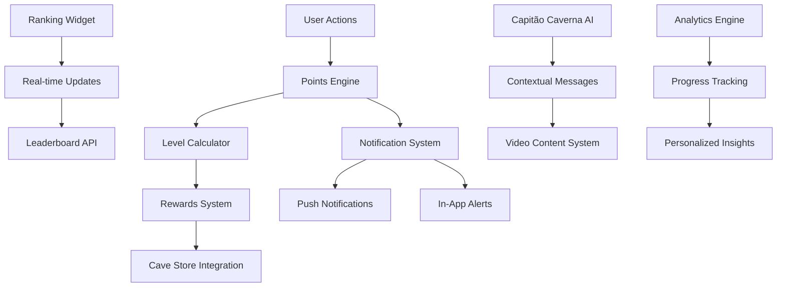

# Design Document - Sistema de Recompensas e Ranking

## Overview

O Sistema de Recompensas e Ranking é uma funcionalidade central que transforma a experiência do usuário em uma jornada gamificada de crescimento pessoal. O sistema integra os sete níveis de transformação com o Capitão Caverna como guia, criando uma narrativa coesa que motiva usuários através de recompensas tangíveis e reconhecimento social.

## Architecture

### System Architecture Diagram



### Data Flow Architecture

1. **Input Layer**: User actions across all platform features
2. **Processing Layer**: Points calculation, level determination, rewards eligibility
3. **Storage Layer**: User progress, rankings, rewards history
4. **Presentation Layer**: Widgets, notifications, Capitão Caverna interactions
5. **Integration Layer**: Cave Store, external services, analytics

## Components and Interfaces

### 1. Points Engine Component

```typescript
interface PointsEngine {
  calculatePoints(action: UserAction): number
  applyMultipliers(basePoints: number, user: User): number
  updateUserScore(userId: string, points: number): Promise<void>
  getPointsHistory(userId: string, period: DateRange): PointsHistory[]
}

interface UserAction {
  type: ActionType
  category: string
  difficulty?: number
  streakMultiplier?: number
  timestamp: Date
  metadata?: Record<string, any>
}

enum ActionType {
  CHALLENGE_COMPLETE = 'challenge_complete',
  LOGIN_STREAK = 'login_streak',
  COMMUNITY_POST = 'community_post',
  POMODORO_SESSION = 'pomodoro_session',
  GOAL_UPDATE = 'goal_update',
  SHAPE_REGISTRATION = 'shape_registration',
  MEAL_PLANNING = 'meal_planning',
  EXERCISE_LOG = 'exercise_log'
}
```

### 2. Transformation Levels Component

```typescript
interface TransformationLevel {
  id: number
  name: string
  description: string
  pointsRequired: number
  benefits: Benefit[]
  videoContent: VideoContent
  capitaoMessage: string
  unlockedFeatures: string[]
}

interface Benefit {
  type: BenefitType
  value: number | string
  description: string
  isActive: boolean
  expiresAt?: Date
}

enum BenefitType {
  STORE_DISCOUNT = 'store_discount',
  EXCLUSIVE_CONTENT = 'exclusive_content',
  PRIORITY_SUPPORT = 'priority_support',
  SPECIAL_EVENTS = 'special_events',
  BONUS_POINTS = 'bonus_points'
}
```

### 3. Ranking Widget Component

```typescript
interface RankingWidget {
  topUsers: RankedUser[]
  currentUser: UserRanking
  lastUpdated: Date
  totalParticipants: number
}

interface RankedUser {
  userId: string
  username: string
  avatar?: string
  level: TransformationLevel
  totalPoints: number
  rank: number
  trend: 'up' | 'down' | 'stable'
}

interface UserRanking {
  rank: number
  percentile: number
  pointsToNextRank: number
  recentActivity: RecentActivity[]
}
```

### 4. Capitão Caverna AI Component

```typescript
interface CapitaoCavernaAI {
  generateMessage(context: MessageContext): Promise<string>
  getVideoContent(level: number, event: string): VideoContent
  scheduleMotivationalMessage(userId: string): void
  celebrateAchievement(achievement: Achievement): CelebrationContent
}

interface MessageContext {
  userId: string
  currentLevel: number
  recentActions: UserAction[]
  timeOfDay: string
  lastInteraction: Date
}

interface VideoContent {
  videoId: string
  soraPrompt: string
  duration: number
  triggers: string[]
  personalizedElements: PersonalizationData
}
```

## User Interactions & Points Mapping

### Points Calculation System

```typescript
interface PointsMapping {
  // Daily Activities
  dailyLogin: 10
  loginStreak: (days: number) => Math.min(days * 2, 50) // Max 50 bonus
  
  // Challenge System
  challengeComplete: {
    easy: 25,
    medium: 50,
    hard: 100,
    expert: 200
  }
  challengeStreak: (days: number) => days * 5 // 5 points per consecutive day
  
  // Community Engagement
  createPost: 15
  commentOnPost: 5
  receiveLike: 2
  giveHelpfulComment: 10
  
  // Productivity
  pomodoroSession: 20
  pomodoroStreak: (sessions: number) => sessions * 3
  goalUpdate: 30
  goalAchievement: 100
  
  // Health & Wellness
  mealPlanUpdate: 15
  exerciseLog: 25
  shapeRegistration: 50
  consistentTracking: (days: number) => days * 2
  
  // Learning & Growth
  courseCompletion: 200
  videoWatched: 10
  noteCreated: 5
  knowledgeSharing: 25
  
  // Special Events
  weeklyChallenge: 150
  monthlyGoal: 500
  communityEvent: 100
  referralBonus: 250
}
```

### Level Progression System

```typescript
interface TransformationLevels {
  1: {
    name: "O Despertar",
    pointsRequired: 0,
    pointsToNext: 1000,
    description: "O início da jornada de transformação",
    benefits: {
      storeDiscount: 5,
      exclusiveContent: ["welcome_series"],
      features: ["basic_tracking", "community_access"]
    }
  },
  2: {
    name: "A Ruptura",
    pointsRequired: 1000,
    pointsToNext: 2500,
    description: "Rompendo com velhos padrões",
    benefits: {
      storeDiscount: 10,
      exclusiveContent: ["rupture_masterclass", "habit_breaking_guide"],
      features: ["advanced_analytics", "goal_templates"],
      bonusMultiplier: 1.1
    }
  },
  3: {
    name: "O Chamado",
    pointsRequired: 3500,
    pointsToNext: 5000,
    description: "Respondendo ao chamado interior",
    benefits: {
      storeDiscount: 15,
      exclusiveContent: ["calling_workshop", "purpose_finder"],
      features: ["custom_challenges", "mentor_access"],
      bonusMultiplier: 1.2,
      specialEvents: ["monthly_mastermind"]
    }
  },
  4: {
    name: "A Descoberta",
    pointsRequired: 8500,
    pointsToNext: 7500,
    description: "Descobrindo seu verdadeiro potencial",
    benefits: {
      storeDiscount: 20,
      exclusiveContent: ["discovery_intensive", "potential_unlocked"],
      features: ["ai_coaching", "personalized_insights"],
      bonusMultiplier: 1.3,
      specialEvents: ["quarterly_retreat"],
      prioritySupport: true
    }
  },
  5: {
    name: "O Discernimento",
    pointsRequired: 16000,
    pointsToNext: 10000,
    description: "Desenvolvendo sabedoria e discernimento",
    benefits: {
      storeDiscount: 25,
      exclusiveContent: ["wisdom_series", "decision_mastery"],
      features: ["advanced_ai_coach", "peer_mentoring"],
      bonusMultiplier: 1.4,
      specialEvents: ["wisdom_council", "leadership_program"],
      prioritySupport: true,
      betaAccess: true
    }
  },
  6: {
    name: "A Ascensão",
    pointsRequired: 26000,
    pointsToNext: 15000,
    description: "Ascendendo a novos patamares",
    benefits: {
      storeDiscount: 30,
      exclusiveContent: ["ascension_mastery", "leadership_intensive"],
      features: ["expert_mode", "community_leadership"],
      bonusMultiplier: 1.5,
      specialEvents: ["ascension_summit", "expert_panel"],
      prioritySupport: true,
      betaAccess: true,
      oneOnOneCoaching: "monthly"
    }
  },
  7: {
    name: "A Lenda",
    pointsRequired: 41000,
    pointsToNext: null,
    description: "Tornando-se uma lenda viva",
    benefits: {
      storeDiscount: 40,
      exclusiveContent: ["legend_vault", "mastery_collection"],
      features: ["legend_mode", "platform_influence"],
      bonusMultiplier: 2.0,
      specialEvents: ["legend_circle", "annual_summit"],
      prioritySupport: true,
      betaAccess: true,
      oneOnOneCoaching: "weekly",
      customPrograms: true,
      platformRecognition: true
    }
  }
}
```

### Detailed Rewards System

```typescript
interface RewardsSystem {
  storeDiscounts: {
    calculation: (level: number) => level * 5 + (level > 4 ? 5 : 0)
    applicableItems: ["courses", "books", "merchandise", "coaching"]
    stackable: false
    monthlyLimit: null
  }
  
  exclusiveContent: {
    videoSeries: ContentAccess[]
    masterclasses: ContentAccess[]
    workshops: ContentAccess[]
    ebooks: ContentAccess[]
    templates: ContentAccess[]
  }
  
  specialEvents: {
    monthlyMastermind: { minLevel: 3, capacity: 50 }
    quarterlyRetreat: { minLevel: 4, capacity: 25 }
    wisdomCouncil: { minLevel: 5, capacity: 15 }
    ascensionSummit: { minLevel: 6, capacity: 10 }
    legendCircle: { minLevel: 7, capacity: 5 }
  }
  
  bonusMultipliers: {
    pointsEarned: (level: number) => 1 + (level - 1) * 0.1
    streakBonus: (level: number) => level >= 3 ? 1.2 : 1.0
    challengeBonus: (level: number) => level >= 5 ? 1.5 : 1.0
  }
  
  prioritySupport: {
    responseTime: "< 4 hours"
    directAccess: true
    videoSupport: true
    minLevel: 4
  }
  
  betaAccess: {
    newFeatures: true
    earlyContent: true
    feedbackProgram: true
    minLevel: 5
  }
  
  coaching: {
    monthly: { minLevel: 6, duration: "60 minutes" }
    weekly: { minLevel: 7, duration: "45 minutes" }
    customPrograms: { minLevel: 7, personalized: true }
  }
}
```

### User Interaction Tracking

```typescript
interface UserInteractionTracking {
  dailyActivities: {
    login: { timestamp: Date, streak: number }
    challenges: { completed: number, difficulty: string[] }
    community: { posts: number, comments: number, likes: number }
    productivity: { pomodoros: number, goals: number }
    wellness: { meals: number, exercises: number }
  }
  
  weeklyMetrics: {
    totalPoints: number
    activeDays: number
    topCategory: string
    streakMaintained: boolean
    challengesCompleted: number
  }
  
  monthlyProgress: {
    levelProgression: number
    pointsGained: number
    benefitsUnlocked: string[]
    eventsAttended: number
    communityContributions: number
  }
  
  achievements: {
    milestones: Milestone[]
    badges: Badge[]
    specialRecognitions: Recognition[]
  }
}
```

### Gamification Psychology

```typescript
interface GamificationElements {
  progressBars: {
    levelProgress: "Visual progress to next level"
    dailyGoals: "Daily point targets"
    streakCounters: "Consecutive day tracking"
    categoryProgress: "Progress in each activity type"
  }
  
  socialElements: {
    leaderboards: "Ranking among peers"
    achievements: "Shareable accomplishments"
    communityRecognition: "Peer acknowledgment"
    mentorship: "Helping others progress"
  }
  
  rewardSchedules: {
    immediate: "Instant point feedback"
    interval: "Daily/weekly bonuses"
    variable: "Surprise rewards and bonuses"
    milestone: "Major achievement celebrations"
  }
  
  personalizedMotivation: {
    adaptiveGoals: "Goals that adjust to user behavior"
    contextualMessages: "Capitão Caverna's personalized guidance"
    progressCelebrations: "Acknowledging small wins"
    recoverySupport: "Help getting back on track"
  }
}
```

## Data Models

### User Progress Model

```typescript
interface UserProgress {
  userId: string
  currentLevel: number
  totalPoints: number
  pointsInCurrentLevel: number
  levelHistory: LevelTransition[]
  achievements: Achievement[]
  benefitsUsed: BenefitUsage[]
  lastActivity: Date
  streakData: StreakData
}

interface LevelTransition {
  fromLevel: number
  toLevel: number
  timestamp: Date
  pointsAtTransition: number
  celebrationViewed: boolean
}

interface StreakData {
  currentLoginStreak: number
  longestLoginStreak: number
  currentChallengeStreak: number
  streakMultiplier: number
}
```

### Rewards and Benefits Model

```typescript
interface RewardsCatalog {
  storeDiscounts: StoreDiscount[]
  exclusiveContent: ExclusiveContent[]
  specialEvents: SpecialEvent[]
  bonusOpportunities: BonusOpportunity[]
}

interface StoreDiscount {
  levelRequired: number
  discountPercentage: number
  applicableCategories: string[]
  maxUsagePerMonth: number
  validUntil?: Date
}
```

## Error Handling

### Points Calculation Errors

```typescript
class PointsCalculationError extends Error {
  constructor(
    message: string,
    public action: UserAction,
    public userId: string
  ) {
    super(message)
    this.name = 'PointsCalculationError'
  }
}

// Error handling strategy
try {
  const points = await pointsEngine.calculatePoints(action)
  await pointsEngine.updateUserScore(userId, points)
} catch (error) {
  if (error instanceof PointsCalculationError) {
    // Log error and use fallback calculation
    logger.error('Points calculation failed', { error, userId })
    await pointsEngine.updateUserScore(userId, getDefaultPoints(action.type))
  }
}
```

### Ranking System Resilience

```typescript
interface RankingFallback {
  getCachedRanking(userId: string): UserRanking | null
  updateRankingAsync(userId: string): Promise<void>
  validateRankingData(ranking: RankingWidget): boolean
}

// Graceful degradation for ranking widget
const getRankingData = async (userId: string): Promise<RankingWidget> => {
  try {
    return await rankingAPI.getCurrentRanking(userId)
  } catch (error) {
    const cached = rankingFallback.getCachedRanking(userId)
    if (cached) {
      // Schedule background update
      rankingFallback.updateRankingAsync(userId)
      return createFallbackWidget(cached)
    }
    throw new RankingUnavailableError('Ranking temporarily unavailable')
  }
}
```

## Testing Strategy

### Unit Testing

```typescript
describe('PointsEngine', () => {
  it('should calculate correct points for challenge completion', () => {
    const action: UserAction = {
      type: ActionType.CHALLENGE_COMPLETE,
      category: 'daily',
      difficulty: 3,
      timestamp: new Date()
    }
    
    const points = pointsEngine.calculatePoints(action)
    expect(points).toBe(150) // Base 50 + difficulty multiplier
  })
  
  it('should apply streak multipliers correctly', () => {
    const user = createMockUser({ loginStreak: 7 })
    const basePoints = 100
    
    const finalPoints = pointsEngine.applyMultipliers(basePoints, user)
    expect(finalPoints).toBe(120) // 20% bonus for 7-day streak
  })
})
```

### Integration Testing

```typescript
describe('Ranking Widget Integration', () => {
  it('should update ranking when user gains points', async () => {
    const userId = 'test-user'
    const initialRank = await getRankingData(userId)
    
    await pointsEngine.updateUserScore(userId, 1000)
    
    const updatedRank = await getRankingData(userId)
    expect(updatedRank.currentUser.rank).toBeLessThan(initialRank.currentUser.rank)
  })
})
```

### Performance Testing

```typescript
describe('Performance Requirements', () => {
  it('should calculate points within 100ms', async () => {
    const startTime = Date.now()
    await pointsEngine.calculatePoints(mockAction)
    const duration = Date.now() - startTime
    
    expect(duration).toBeLessThan(100)
  })
  
  it('should handle 1000 concurrent ranking requests', async () => {
    const requests = Array(1000).fill(null).map(() => 
      getRankingData(`user-${Math.random()}`)
    )
    
    const results = await Promise.allSettled(requests)
    const successful = results.filter(r => r.status === 'fulfilled').length
    
    expect(successful / results.length).toBeGreaterThan(0.95) // 95% success rate
  })
})
```

## Security Considerations

### Points Manipulation Prevention

```typescript
interface PointsValidation {
  validateAction(action: UserAction, userId: string): Promise<boolean>
  detectAnomalousActivity(userId: string): Promise<AnomalyReport>
  rateLimit(userId: string, actionType: ActionType): Promise<boolean>
}

// Anti-gaming measures
const securePointsUpdate = async (userId: string, action: UserAction) => {
  // Validate action authenticity
  const isValid = await pointsValidation.validateAction(action, userId)
  if (!isValid) {
    throw new InvalidActionError('Action validation failed')
  }
  
  // Check rate limits
  const withinLimits = await pointsValidation.rateLimit(userId, action.type)
  if (!withinLimits) {
    throw new RateLimitError('Action rate limit exceeded')
  }
  
  // Detect anomalous patterns
  const anomaly = await pointsValidation.detectAnomalousActivity(userId)
  if (anomaly.riskLevel === 'HIGH') {
    await flagForReview(userId, anomaly)
  }
  
  return pointsEngine.updateUserScore(userId, calculatePoints(action))
}
```

### Data Privacy

```typescript
interface PrivacyControls {
  anonymizeRankingData(user: RankedUser): RankedUser
  getUserConsent(userId: string, dataType: string): Promise<boolean>
  handleDataDeletion(userId: string): Promise<void>
}

// Privacy-compliant ranking display
const getPublicRanking = async (userId: string): Promise<RankingWidget> => {
  const ranking = await getRankingData(userId)
  
  return {
    ...ranking,
    topUsers: ranking.topUsers.map(user => 
      privacyControls.anonymizeRankingData(user)
    )
  }
}
```

## Scalability Architecture

### Caching Strategy

```typescript
interface CacheStrategy {
  userRankings: CacheConfig
  leaderboards: CacheConfig
  pointsCalculations: CacheConfig
}

const cacheConfig: CacheStrategy = {
  userRankings: {
    ttl: 300, // 5 minutes
    strategy: 'write-through',
    invalidationTriggers: ['points_update', 'level_change']
  },
  leaderboards: {
    ttl: 60, // 1 minute
    strategy: 'write-behind',
    refreshInterval: 30
  },
  pointsCalculations: {
    ttl: 3600, // 1 hour
    strategy: 'cache-aside',
    precompute: true
  }
}
```

### Database Optimization

```sql
-- Optimized indexes for ranking queries
CREATE INDEX idx_user_progress_points ON user_progress(total_points DESC, user_id);
CREATE INDEX idx_user_progress_level ON user_progress(current_level, total_points DESC);
CREATE INDEX idx_points_history_user_date ON points_history(user_id, created_at DESC);

-- Partitioning strategy for large datasets
CREATE TABLE points_history_2024 PARTITION OF points_history
FOR VALUES FROM ('2024-01-01') TO ('2025-01-01');
```

This design provides a comprehensive foundation for implementing the rewards and ranking system while maintaining performance, security, and scalability requirements.